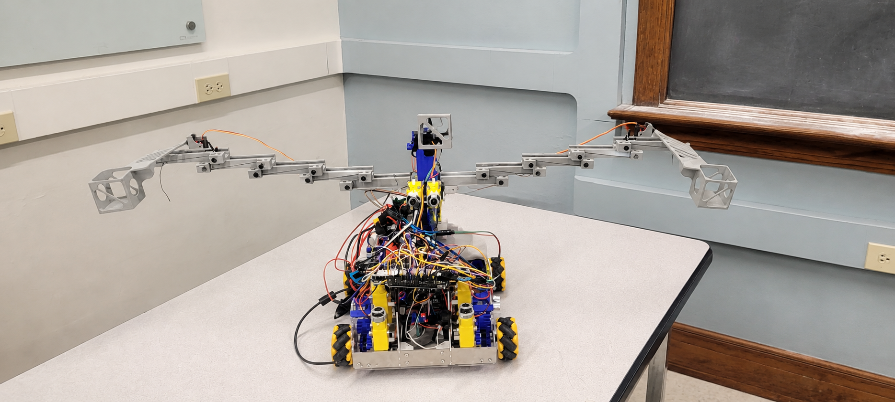
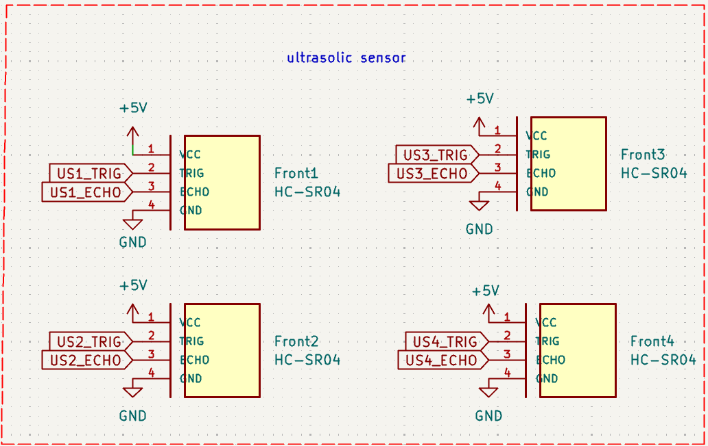
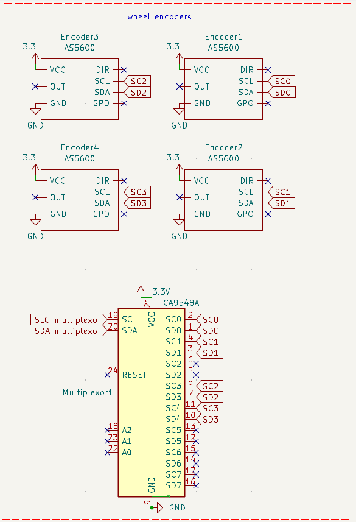
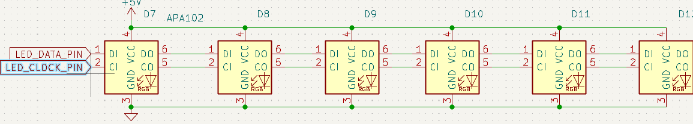
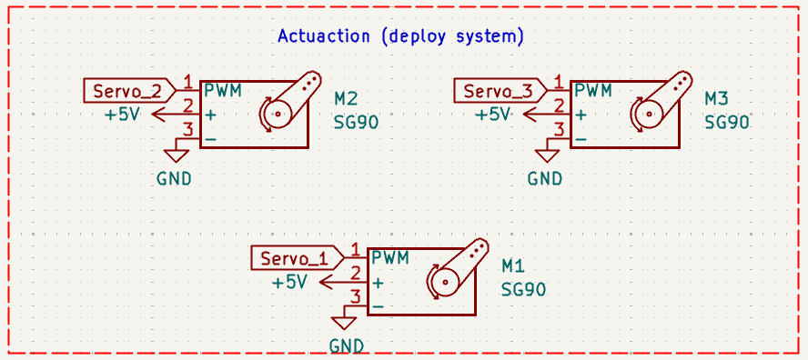
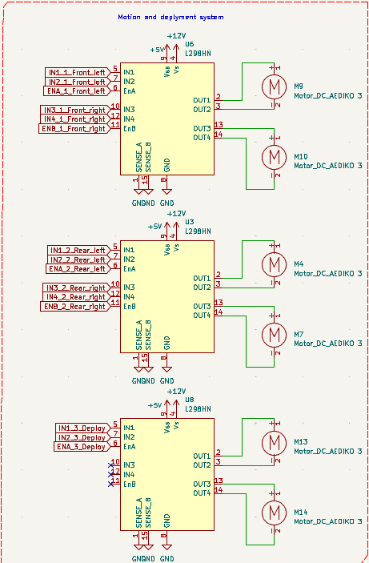
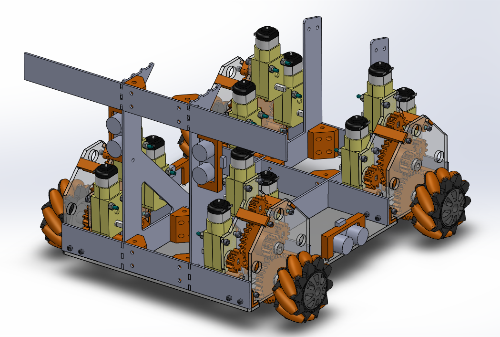
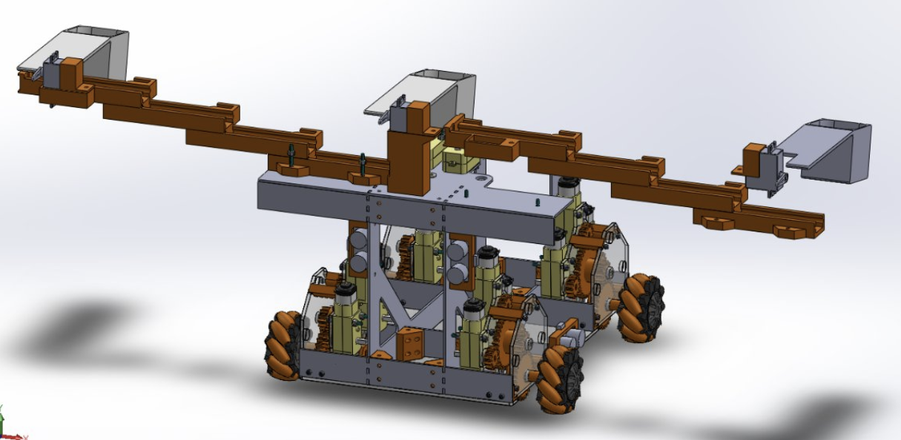

# Storm that Castle — Autonomous Multi-HILL Capture Robot

This repository documents the design, electronics, control logic, and competition outcome of **Team 6's autonomous robot** for the ME 588 STORM competition: **Storm that Castle: Fight to be King of the HILL**.

The robot was designed to autonomously navigate the playing field, detect HILL status using infrared frequency sensing, position itself using ultrasonic distance feedback, and deploy foam UNITs using a servo-based delivery system. The central strategy was to capture multiple HILLs at the end of the match by delivering several UNITs nearly simultaneously.

## Competition Result

The project was successful. Although the robot experienced some distance-sensing challenges during development and competition runs, the final system reached the final round of the competition. The robot tied in the final match and finished **second place only by tiebreaker**.

This result showed that the team's design approach, competition strategy, mechanical concept, electronics integration, and control implementation were sufficient to compete at a high level and validate the overall system architecture.

<p align="center">
   
</p>

<p align="center">
  
</p>

[Watch the final second round video](Result/final%20second%20round.mp4)

## Project Strategy

The main strategy was based on the fact that HILL control at the end of the match determines the result. Instead of continuously fighting for every HILL during the full match, the robot was designed to:

1. Navigate to the scoring position.
2. Align with multiple HILLs.
3. Deploy an extension/scoring system.
4. Release UNITs near the end of the match.
5. Capture multiple HILLs in a single final action.

This approach reduced the need for continuous scoring and focused on a decisive last-second capture.

## System Overview

The robot integrates the following major subsystems:

- **Mecanum-wheel drivetrain** for forward, backward, lateral, and alignment motion.
- **Ultrasonic sensing system** for distance-based navigation and positioning.
- **Infrared frequency detection system** for identifying HILL/team status.
- **AS5600 wheel encoders** connected through a TCA9548A I2C multiplexer.
- **Servo-controlled deployment system** for releasing UNITs.
- **APA102 LED display strip** for team selection and system status feedback.
- **Arduino Mega 2560** as the main controller.
- **L298N motor drivers** for drivetrain and deployment motor control.

## Repository Structure

```text
.
├── README.md
├── Competition_Arduino_code/
│   └── Competition_code.ino
├── Images/
│   ├── IR sensor.png
│   ├── arduino conections.png
│   ├── display.png
│   ├── encoders.png
│   ├── l298.png
│   ├── servos.png
│   ├── team selector.png
│   └── ultrasonic.png
├── KiCad files/
│   ├── lab7-backups/
│   ├── LEDS.kicad_sch
│   ├── distance.kicad_sch
│   ├── fp-info-cache
│   ├── lab7.kicad_pcb
│   ├── lab7.kicad_prl
│   ├── lab7.kicad_pro
│   ├── lab7.kicad_sch
│   ├── motors.kicad_sch
│   ├── power.kicad_sch
│   ├── servos.kicad_sch
│   └── untitled.kicad_sch
└── Result/
    ├── competition version.jpeg
    ├── drivetrain.png
    ├── final second round.mp4
    ├── robot.png
    └── robot_v1.jpeg
```

> The folder names above are recommended for organizing the GitHub repository. The images referenced in this README assume that all schematic images are stored inside the `Images/` folder.

## Electrical Architecture

The complete electrical system connects the Arduino Mega to the sensors, motor drivers, servos, LED strip, and team selector switch.


### Main Controller

The main controller is an **Arduino Mega 2560**, selected because the robot required a high number of digital I/O pins for ultrasonic sensors, IR sensors, motor drivers, servos, LEDs, and the I2C multiplexer.

## Team Selector

The team selector is implemented with a switch connected to the Arduino using an internal pull-up configuration. One side of the selector is connected to GND, and the signal pin is read by the controller to determine the active team color.

<p align="center">
   
</p>


| Function | Arduino Pin | Notes |
|---|---:|---|
| Team selector signal | D40 | Uses `INPUT_PULLUP` |
| Switch common | GND | LOW state when connected to ground |

## Ultrasonic Sensor System

The robot uses four HC-SR04 ultrasonic sensors to estimate distances and support autonomous navigation. These sensors were used to approach HILL structures, maintain distance, and determine when the robot reached a deployment position.

<p align="center">
   
</p>

| Sensor | Trigger Pin | Echo Pin | Purpose |
|---|---:|---:|---|
| US1 | D30 | D31 | Distance sensing |
| US2 | D32 | D33 | Distance sensing |
| US3 | D34 | D35 | Distance sensing |
| US4 | D36 | D37 | Distance sensing |

### Ultrasonic Calibration Notes

Some distance-sensing issues were observed during testing. The main improvements used during development were:

- Averaging multiple readings to reduce noise.
- Defining minimum and maximum valid distance thresholds.
- Using calibration offsets when two sensors were not mounted at exactly the same physical depth.
- Slowing the robot near the target to reduce overshoot.
- Testing distances repeatedly before competition runs.

Even with these challenges, the final robot was able to complete the strategy well enough to reach the final match.

## Infrared Frequency Sensor System

The IR system uses QSD123 NPN phototransistors with pull-up resistors. The Arduino reads the signal frequency and classifies the detected HILL/team state.

<p align="center">
   
</p>


| IR Sensor | Arduino Pin | Function |
|---|---:|---|
| IR1 | D2 | Left reference / scoring position |
| IR2 | D3 | Center reference / scoring position |
| IR3 | D4 | Right reference / scoring position |

### Frequency Classification

The control software classifies the detected frequency into a team state. The working reference frequencies were:

| Team State | Approximate Frequency |
|---|---:|
| Blue | 780 Hz |
| Red | 1560 Hz |
| Unknown | Outside expected frequency range |

The IR readings were also displayed through the APA102 LED strip so the team could visually confirm what the robot was detecting during operation.

## Wheel Encoder System

Each wheel uses an AS5600 magnetic encoder. Because all AS5600 devices share the same I2C address, a **TCA9548A I2C multiplexer** is used to isolate each encoder on a separate bus channel.

<p align="center">
   
</p>


| Encoder | MUX Channel | Wheel Location |
|---|---:|---|
| Encoder 1 | Channel 0 | Front / drivetrain feedback |
| Encoder 2 | Channel 1 | Rear / drivetrain feedback |
| Encoder 3 | Channel 3 | Front / drivetrain feedback |
| Encoder 4 | Channel 4 | Rear / drivetrain feedback |

| I2C Signal | Arduino Mega Pin |
|---|---:|
| SDA | D20 |
| SCL | D21 |

The encoders were used mainly for wheel feedback, debugging, motor direction verification, and improving motion consistency.

## LED Display System

The robot uses an APA102 LED strip to provide visual feedback for team selection, navigation state, point detection, and IR frequency classification.

<p align="center">
   
</p>

| LED Signal | Arduino Pin |
|---|---:|
| LED data | D51 |
| LED clock | D52 |
| VCC | +5V |
| GND | GND |

### LED Status Concept

| LED Position | Status Role |
|---|---|
| LED 1 | Selected team color |
| LED 2 | General system status |
| LED 3 | Navigation / deployment point status |
| LED 4 | IR1 detected team/frequency |
| LED 5 | IR2 detected team/frequency |
| LED 6 | IR3 detected team/frequency |

Example status logic:

- **Blue or Red**: selected team or detected HILL state.
- **Green**: robot reached the deployment point.
- **Orange**: ready or waiting state.
- **Off**: inactive or unknown state.

## Servo Deployment System

The deployment system uses three SG90 servos to release UNITs from individual scoop mechanisms. This approach was selected instead of a launcher because it was mechanically simpler, more repeatable, and easier to control.

<p align="center">
   
</p>

| Servo | Arduino Pin | Function |
|---|---:|---|
| Servo 1 | D44 | Left/primary scoop mechanism |
| Servo 2 | D49 | Center scoop mechanism |
| Servo 3 | D46 | Right scoop mechanism |

> Note: If the firmware version uses Servo 2 on D45, keep the schematic and code synchronized before uploading.

### Servo Motion Concept

The deployment sequence uses two main positions:

```cpp
// Holding / initial position
servo1.write(0);
servo2.write(180);
servo3.write(180);

// Deployment position
servo1.write(180);
servo2.write(0);
servo3.write(0);
```

A short delay was added between commands to avoid sudden motion and reduce mechanical stress on the scoop connections.

## Motor Driver and Motion System

The drivetrain and deployment motor are controlled using L298N motor drivers. The mecanum-wheel configuration allows the robot to move forward, backward, sideways, and make fine alignment corrections.



### Motor Driver Pin Map

| Subsystem | Arduino Pin | Function |
|---|---:|---|
| Front left ENA | D5 | PWM speed control |
| Front left IN1 | D22 | Direction control |
| Front left IN2 | D23 | Direction control |
| Front right ENB | D6 | PWM speed control |
| Front right IN3 | D24 | Direction control |
| Front right IN4 | D25 | Direction control |
| Rear left ENA | D9 | PWM speed control |
| Rear left IN1 | D26 | Direction control |
| Rear left IN2 | D27 | Direction control |
| Rear right ENB | D10 | PWM speed control |
| Rear right IN3 | D28 | Direction control |
| Rear right IN4 | D29 | Direction control |
| Deploy motor ENA | D11 | PWM speed control |
| Deploy motor IN1 | D38 | Direction control |
| Deploy motor IN2 | D39 | Direction control |

## Control Strategy

The robot behavior was organized using a finite-state-machine style control approach. This made the autonomous routine easier to test, debug, and modify.

### Main States

| State | Description |
|---|---|
| Idle | Wait for start condition |
| Team Selection | Read selected team color |
| Navigate | Move toward the target region |
| Lateral Alignment | Move sideways using mecanum wheels |
| IR Detection | Detect HILL/team state through IR frequency |
| Approach | Move to the required ultrasonic distance |
| Deploy | Extend mechanism and release UNITs |
| Stop / Finish | End the autonomous routine |

### General Autonomous Flow

```text
Start
  ↓
Read team selector
  ↓
Begin navigation
  ↓
Use ultrasonic sensors for distance feedback
  ↓
Move laterally to the target HILL region
  ↓
Approach final deployment distance
  ↓
Deploy mechanism
  ↓
Detect IR references and HILL/team state
  ↓
Release UNITs with servos
  ↓
Stop
```

## Mechanical Design Summary

The robot used a compact frame with a mecanum-wheel drivetrain and a deployable scoring mechanism. Instead of storing and launching many UNITs from a single mechanism, the design used individual scoops that held one UNIT each. This reduced complexity and improved control over the release event.

Key mechanical features:

- Compact robot structure to satisfy competition size constraints.
- Mecanum wheels for lateral movement and alignment.
- Servo-driven scoop mechanisms for controlled UNIT release.
- Extension/deployment mechanism to reach multiple HILLs.
- Modular structure for easier testing and repair.

## Testing and Iteration

The robot was tested through multiple subsystem and full-system trials. Important testing activities included:

- Individual motor direction testing.
- Mecanum movement testing.
- Ultrasonic distance calibration.
- IR frequency classification tests.
- Encoder channel validation through the multiplexer.
- Servo deployment timing tests.
- Full autonomous routine testing.


<p align="center">
  
  
</p>

The most important improvements came from sensor calibration, motor speed tuning, and adjusting the timing between navigation, alignment, deployment, and servo release.

## Known Challenges

The main challenges during the project were:

- Ultrasonic distance readings varied depending on angle, surface, and robot alignment.
- Sensor placement differences required calibration offsets.
- Mecanum movement required careful motor direction and speed tuning.
- Servo movement needed timing delays to avoid mechanical strain.
- IR frequency detection required threshold tuning to avoid unknown readings.

Despite these limitations, the final robot performed competitively and reached the final match.

## Final Outcome

The robot achieved the main project goals:

- Autonomous navigation was implemented.
- HILL detection and positioning were achieved using ultrasonic sensing.
- IR frequency detection was integrated into the system.
- UNIT delivery was completed with a servo-based deployment mechanism.
- The team reached the competition final.
- The final match ended in a tie, and the robot finished second only due to the tiebreaker.

This confirmed that the project strategy, system integration, and design decisions were successful.

## Team

**Team 6**

- Aadit Kumar
- Arijeet Kamat
- Dhanush Manjunath
- Emmanuel Correa Morales
- Kyle DeLay
- Supreet Mishra

## Acknowledgments

This project was completed for ME 588 as part of the STORM autonomous robot competition. The team acknowledges the support of the course staff, lab resources, machine shop access, and testing opportunities that made the final robot possible.

## Future Improvements

Possible improvements for a future version include:

- More robust distance estimation using sensor fusion.
- Improved ultrasonic mounting to reduce angle-related errors.
- Closed-loop mecanum control using encoder feedback.
- Better mechanical isolation for servo loads.
- More compact PCB integration.
- Additional validation routines before autonomous start.

## License

<<<<<<< HEAD
This repository is intended for academic documentation and educational use. Add a specific license file if the project will be shared publicly or reused by other teams.
=======
This repository is intended for academic documentation and educational use. Add a specific license file if the project will be shared publicly or reused by other teams.
>>>>>>> 73761292f52b6304cfc107fe5185355af6c8e453
